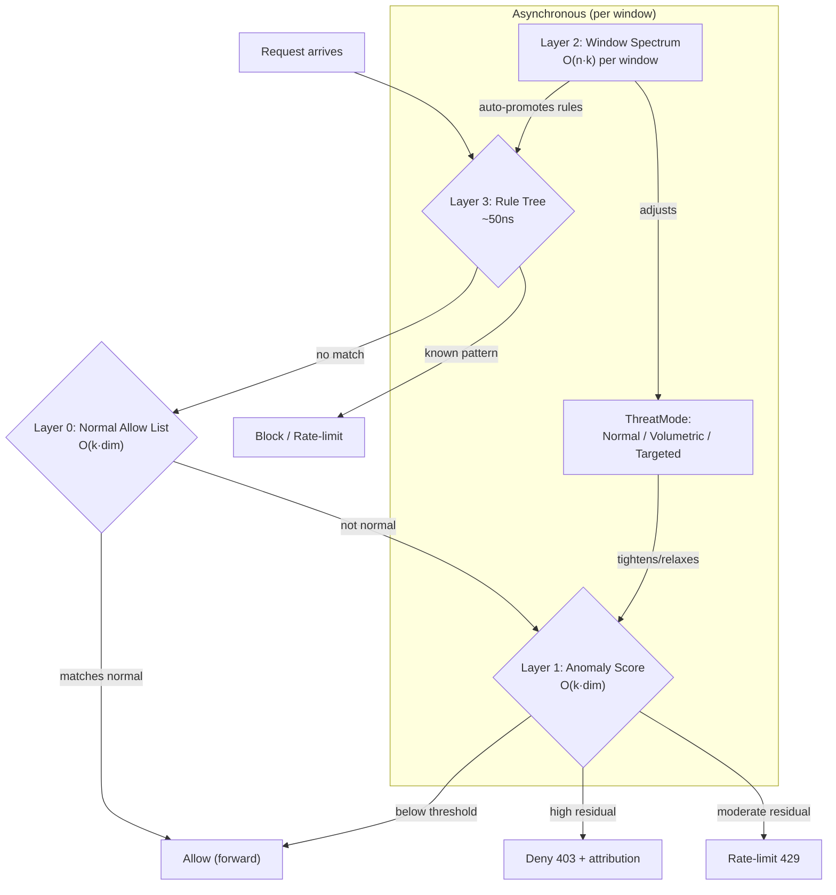
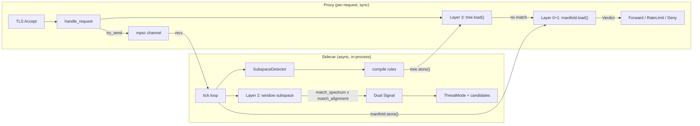

# Concept: Manifold Firewall — Surprise as Rule, Normal as Allow List

**Status:** Implemented and validated — see [FINDINGS-MANIFOLD-FIREWALL.md](FINDINGS-MANIFOLD-FIREWALL.md)
**Date:** February 28, 2026 (concept) / March 3, 2026 (validated)

## The Insight

The current pipeline: detect anomaly → extract fields → generate symbolic rule → enforce rule. The surprise is a trigger. The symbolic rule is the weapon.

The inversion: **surprise IS the weapon**. The subspace residual score is the firewall rule. The symbolic extraction provides the audit trail, not the enforcement mechanism.

Take it one step further: the ideal firewall is an **allow list**, not a deny list. Learn what normal looks like. Store it. Allow what matches. Explain what doesn't. The attacker's burden flips — they must make their traffic genuinely indistinguishable from real users, not just dodge specific field checks.

Take it one step further still: **meta engrams**. Don't just score individual requests against the manifold — score the *shape of a traffic window*. If the eigenvalue spectrum of a 30-second window matches a known attack pattern, detect it before per-packet analysis confirms it. Early warning from the distribution's geometry.

## Architecture: Four-Layer Defense

```
Layer 0: Normal Allow List (manifold membership)
  "Does this request look like known-normal traffic?"
  Mechanism: project request vector onto normal engram subspaces
  Cost: O(k·dim) per request — one projection per normal engram
  Signal: pass/fail with confidence score
  Explainability: drilldown_probe shows which fields diverge from normal

Layer 1: Anomaly Enforcement (surprise-as-rule)
  "Is this request far from the learned baseline?"
  Mechanism: residual score against OnlineSubspace baseline
  Cost: O(k·dim) per request — ~0.4ms single-threaded
  Signal: continuous score, thresholded for action
  Explainability: drilldown_probe ranks field contributions
  Action: rate-limit proportional to residual magnitude

Layer 2: Window-Level Spectrum Matching (meta engrams)
  "Does this traffic window's shape match a known pattern?"
  Mechanism: match_spectrum — cosine similarity of eigenvalue vectors
  Cost: O(n·k) per window — orders of magnitude cheaper than per-packet
  Signal: early warning, temporal fingerprinting, blind anomaly detection
  Explainability: eigenvalue shift identifies which variance dimensions changed
  Action: activate threat level, narrow per-packet scoring to candidate engrams

Layer 3: Symbolic Rule Tree (known patterns)
  "Does this request match a known attack signature?"
  Mechanism: ExprCompiledTree — Rete-spirit DAG, O(tree depth) evaluation
  Cost: ~50ns miss, ~1-2µs hit — sub-microsecond regardless of rule count
  Signal: exact match with rule ID
  Explainability: full EDN rule expression
  Action: block, rate-limit, close — immediate enforcement
```

## How the Layers Compose



Layer 3 runs first because it's cheapest (~50ns). Known threats are handled without touching the manifold. Only unknown traffic reaches the geometric layers.

Layer 0 runs next — does this look like normal traffic we've seen before? If yes, pass it through. The allow list is the primary defense for legitimate traffic.

Layer 1 runs on traffic that doesn't match normal. The residual score is the continuous enforcement signal — higher residual = more anomalous = more aggressive rate limiting. No symbolic rule needed. The geometry IS the rule. Two distinct responses for two distinct threats:
- **DDoS** (high concentration, moderate residual) → **rate-limit** (429)
- **Exploits** (structurally alien, high residual) → **deny** (403)

Layer 2 runs asynchronously on traffic windows, not individual requests. It provides the strategic view: "the shape of traffic is changing" triggers before per-packet anomalies accumulate. It adjusts which normal engrams are active and pre-filters the engram library for per-packet scoring.

## System Architecture



The sidecar publishes two shared objects via ArcSwap (wait-free reads):

- `ExprCompiledTree` (Layer 3) — symbolic rules, auto-promoted from detections
- `ManifoldState` (Layers 0+1+2) — baseline subspace, normal engrams, threat mode

## DDoS vs Exploit: Two Paths Through the Same Geometry

**Example: 100K RPS GET / flood (DDoS)**

1. First ~500ms: Layer 0+1 catches it per-request (moderate residual → rate-limit)
2. Layer 2 detects collapsed spectrum → sidecar generates rate-limit rules
3. Rules inject into ExprCompiledTree (Layer 3) — flood now handled at ~50ns
4. Manifold layers freed up to focus on anything else

**Example: Low-and-slow Nuclei/ZAP/Nikto scan (Exploit)**

1. Each probe is unique — no concentration, no rule ever generated
2. Layer 0: "this doesn't look like any normal traffic" → fail
3. Layer 1: high residual (alien structure) → deny (403)
4. Every single probe caught individually by geometry

## Why Allow List > Deny List

A deny list says: "here are the bad things, block them." The attacker's job is to not be on the list. They always win eventually because the attack surface is infinite and the list is finite.

An allow list says: "here is what normal looks like, allow it." The attacker's job is to make their traffic genuinely indistinguishable from real users. They must replicate:
- The TLS fingerprint of a real browser (ClientHello, cipher suites, extension ordering)
- The HTTP structure of real requests (header ordering, path patterns, query structure)
- The temporal distribution of real usage (request rates, session patterns)
- All simultaneously, consistently, across the entire attack

This is fundamentally harder than dodging field checks. The manifold captures the *joint distribution* of all fields — an attacker who matches the path but not the TLS fingerprint, or matches both but at an abnormal rate, still falls outside the normal manifold.

## Explainable Surprise

Every enforcement decision at layers 0 and 1 produces an explanation via `drilldown_probe`:

```
BLOCKED: request anomaly score 34.8 (threshold 20.9)
  Attribution:
    user-agent:     43.5% of anomaly  ("libwww-perl/6.72" — not in normal manifold)
    tls-ext-types:  27.1% of anomaly  (extension set differs from browser profiles)
    path structure: 18.3% of anomaly  ("/api/data" at abnormal frequency)
    header order:   11.1% of anomaly  (Host,User-Agent,Accept — not browser ordering)
```

This is not a symbolic rule. It's a geometric decomposition of *why* this request is far from normal. For auditing, compliance, and debugging, it's strictly more informative than "matched rule #47" — it shows the continuous contribution of every field to the anomaly.

The symbolic rules (layer 3) still exist for cases where human operators want to express explicit policy: "always block this IP range", "rate-limit this endpoint to 100 rps". But the primary defense doesn't need them.

## Normal Engram Library

The key to the allow list is a rich library of "normal":

- **Time-of-day engrams**: traffic at 2am looks different from traffic at 2pm. Different normal manifolds for different periods.
- **User-population engrams**: mobile users vs desktop users vs API consumers each have distinct TLS/HTTP fingerprints.
- **Endpoint engrams**: `/api/search` has different normal patterns than `/api/v1/auth/login`.
- **Seasonal engrams**: Black Friday traffic is different from a Tuesday in February.

A request matches normal if it projects well onto *any* active normal engram. The library grows over time as the system observes more legitimate traffic patterns.

During attacks, the normal library freezes — attack traffic cannot shift the definition of normal. This is the same baseline-freeze mechanism already implemented in `FieldTracker`, extended to the engram library.

## Meta Engrams: Window-Level Pattern Matching

From batch 018 (`match_spectrum`): instead of "does this packet look like a known attack?", ask "does this *30-second window of traffic* look like a known attack?"

The eigenvalue signature of a traffic window captures its distributional shape — how variance is distributed across dimensions. Different attack types produce different eigenvalue distortions:
- SYN flood: variance collapses onto a few dimensions (uniform traffic → low-rank)
- Credential stuffing: variance shifts to specific path/body dimensions
- Scraper: variance spreads across path dimensions (many random paths)
- Slow exfiltration: subtle eigenvalue shift, hard to detect per-packet

`match_spectrum` compares these shapes at O(n·k) cost — orders of magnitude cheaper than per-packet scoring. It provides:

1. **Early warning**: eigenvalue shift precedes per-packet residual hits
2. **Blind detection**: novel attacks produce unrecognized eigenvalue shapes (low similarity to all engrams = "something is wrong but we don't know what")
3. **Temporal fingerprinting**: attack lifecycle phases (onset, peak, subsidence) produce evolving eigenvalue trajectories
4. **Pre-filtering**: narrow per-packet scoring to the 1-2 most likely engrams instead of the full library

## What This Changes

Traditional WAF: human writes rules → engine checks rules → block/allow. The human is the bottleneck. The rules are discrete. The attacker evades by being outside the rules.

Current http-lab: system detects anomaly → generates symbolic rules → engine checks rules. The detection is the bottleneck. The rules are still discrete. But the system generates them autonomously.

Manifold firewall: system learns normal → scores everything against the manifold → the geometry IS the rule. No bottleneck. No discretization. The attacker must be *inside* the normal manifold to pass — which means being genuinely normal.

The symbolic rules (layer 3) become the *fast path for known threats*, not the primary defense. The manifold (layers 0-1) is the primary defense. The spectrum (layer 2) is the strategic awareness layer. Together:

- Layer 3 handles known threats in ~50ns
- Layer 0 passes normal traffic in ~0.4ms
- Layer 1 catches novel threats in ~0.4ms with full attribution
- Layer 2 provides early warning and trend detection at window granularity

Everything is explainable. Everything is auditable. Nothing requires human-authored rules to function.

## Implementation Path

Most of the machinery already exists:

| Capability | Status | Notes |
|---|---|---|
| OnlineSubspace scoring | **Inline in proxy** | ManifoldState via ArcSwap, evaluate_manifold() |
| drilldown_probe | **Inline in proxy** | drilldown_audit() on deny, logged per request |
| EngramLibrary (normal) | **Implemented** | baseline-normal minted at warmup, freeze/thaw on threat mode |
| match_spectrum / WindowTracker | **Implemented** | Layer 2 window classification: Normal/Volumetric/Targeted |
| Baseline freeze | **Implemented** | Normal engrams freeze during Volumetric/Targeted, thaw on Normal |
| ExprCompiledTree | **Implemented** | Layer 3, ~50ns miss, auto-promoted from sidecar detections |
| ArcSwap ManifoldState | **Implemented** | Sidecar publishes, proxy reads wait-free |
| Denial context tokens | **Implemented** | AES-256-GCM sealed tokens with field attribution |
| Engram CLI (CI/CD) | **Implemented** | holon-engram binary: list, export, import |
| Staleness tracking | **Implemented** | Flags drifted normal engrams |
| Multi-core scoring | Designed | Required for >40K RPS inline scoring |

The critical engineering challenge: inline subspace scoring at request rate. At ~0.4ms per score, single-threaded throughput is ~2,500 RPS. On 16 cores with the scoring path parallelized (read-only subspace snapshot via ArcSwap), throughput reaches ~40K RPS — viable for WAF, not for volumetric DDoS. For DDoS, layer 3 (rule tree) and layer 2 (window matching) handle the volume; layers 0-1 handle the precision.

---

*This document captures the conceptual architecture. Implementation completed March 3, 2026. Experimental validation showed 97-100% scanner denial rate, 0% false positive rate on normal traffic, and 41 microsecond p50 deny-path latency. See [FINDINGS-MANIFOLD-FIREWALL.md](FINDINGS-MANIFOLD-FIREWALL.md) for full results.*
