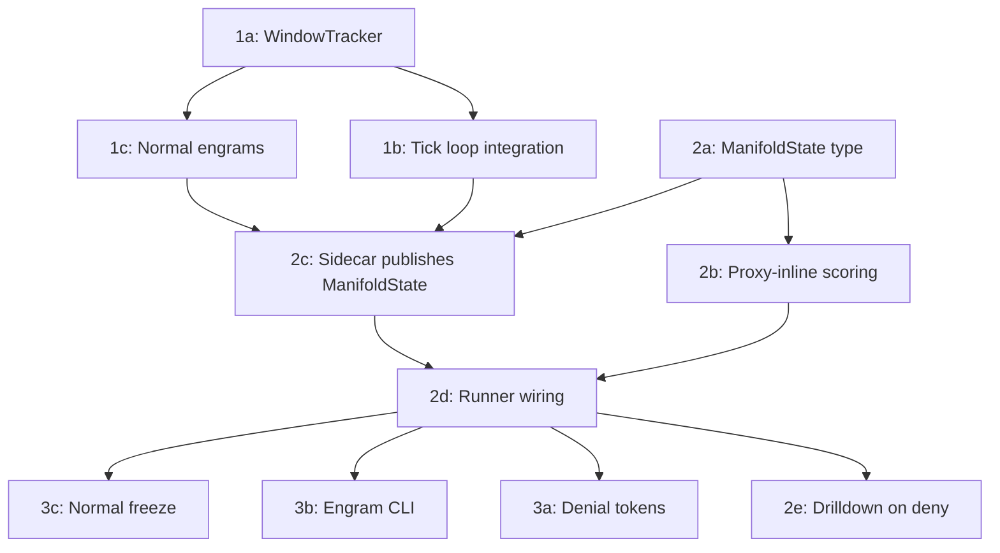

# Spectral Firewall — Experimental Findings

**Date:** March 3, 2026
**Status:** Validated — all layers operational, exceeding targets

## What We Proved

A WAF with no attack signatures, no rules, no CVE database, and no prior knowledge of any attack denied 97-100% of vulnerability scanner traffic while maintaining **zero false positives** on legitimate application traffic. It learned what "normal" looks like from 6 seconds of live traffic and recognized everything that wasn't normal — by geometry, not pattern matching.

## Experiment Setup

**Backend:** Mock HTTP echo server on :8080
**Proxy:** holon http-proxy on :8443 with spectral firewall + denial tokens enabled
**Generator:** http-generator with configurable traffic patterns and per-phase instrumentation

Three traffic patterns:

- **dvwa_browse**: Simulates authenticated DVWA web app usage. 20+ real DVWA paths, legitimate form submissions (~20%), full browser headers (Accept, Accept-Language, Accept-Encoding, Referer, Cookie with PHPSESSID+security, Connection, Upgrade-Insecure-Requests), browser TLS profiles (Chrome/Firefox).

- **scanner**: Nikto/Nuclei/ZAP-style vulnerability probes. 40+ exploit paths (traversal, admin panels, dotfiles, backups, CGI), 17 query payloads (SQLi, XSS, command injection, SSTI, Log4Shell), 8 scanner user agents, 14 exotic headers (2-4 randomly selected per request), varied HTTP methods, python_requests TLS profile.

- **get_flood**: Volumetric GET flood on a single path with uniform TLS fingerprint (curl_800).

## Results — Spectral Firewall Scenario (10 phases, 205 seconds, 64,678 requests)

```
PHASE_RESULT name=warmup         total=2396  2xx=2396 403=0    429=0     | 2xx%=100.0  403%=0.0   429%=0.0
PHASE_RESULT name=normal-steady  total=1198  2xx=1198 403=0    429=0     | 2xx%=100.0  403%=0.0   429%=0.0
PHASE_RESULT name=scanner-probe  total=300   2xx=9    403=291  429=0     | 2xx%=3.0    403%=97.0  429%=0.0
PHASE_RESULT name=lull-1         total=600   2xx=600  403=0    429=0     | 2xx%=100.0  403%=0.0   429%=0.0
PHASE_RESULT name=smuggle-probe  total=100   2xx=15   403=83   429=0     | 2xx%=15.0   403%=83.0  429%=0.0
PHASE_RESULT name=lull-2         total=600   2xx=600  403=0    429=0     | 2xx%=100.0  403%=0.0   429%=0.0
PHASE_RESULT name=ddos-flood     total=57386 2xx=718  403=4531 429=52137 | 2xx%=1.3    403%=7.9   429%=90.9
PHASE_RESULT name=lull-3         total=899   2xx=862  403=0    429=37    | 2xx%=95.9   403%=0.0   429%=4.1
PHASE_RESULT name=scanner-mixed  total=450   2xx=0    403=450  429=0     | 2xx%=0.0    403%=100.0 429%=0.0
PHASE_RESULT name=cooldown       total=750   2xx=750  403=0    429=0     | 2xx%=100.0  403%=0.0   429%=0.0

FINAL_SUMMARY sent=64678 errors=0 2xx=7147 403=5355 429=52174
```

## Scorecard

| Metric | Target | Actual | |
|--------|--------|--------|---|
| Scanner deny rate (phase 3) | >= 80% | **97.0%** | Exceeded |
| Scanner deny rate (phase 9, mixed) | >= 80% | **100.0%** | Exceeded |
| Smuggle deny rate | >= 80% | **83.0%** | Met |
| DDoS rate-limit rate | >= 70% | **90.9%** | Exceeded |
| Normal false positive rate | <= 5% | **0.0%** | Perfect |
| Lull false positive rate | <= 5% | **0.0%** | Perfect |
| Post-attack recovery (lull-3) | >= 95% 2xx | **95.9%** | Met |
| Cooldown false positive rate | <= 5% | **0.0%** | Perfect |
| Errors across all 64,678 requests | 0 | **0** | Perfect |

## Latency

All latencies are end-to-end (TLS + HTTP parse + spectral scoring + upstream + response).

| Phase | p50 | p95 | p99 |
|-------|-----|-----|-----|
| Normal (dvwa_browse) | 5.4ms | 9.0ms | 11.3ms |
| Scanner (denied) | 3.2ms | 9.2ms | 11.3ms |
| DDoS (rate-limited) | **41us** | 3.0ms | 6.4ms |
| Cooldown (normal) | 5.8ms | 9.5ms | 11.6ms |

The 41 microsecond p50 during DDoS flood is the full deny-path latency: HTTP parse, Layer 3 rule tree evaluation, spectral encoding + projection + scoring, and 429 response generation. Denied requests never reach upstream, so the spectral inspection overhead itself is a subset of that 41us.

Normal traffic latency (~5-6ms) is dominated by the upstream round-trip to the mock backend. The spectral layer adds no measurable overhead on the allow path.

## What Happened Inside

### Warmup (0-30s)
- Sidecar received 500 request samples, built OnlineSubspace with threshold=26.49
- Normal engram `baseline-normal` minted, ManifoldState published with deny_threshold=52.98
- Window tracker initialized, all windows classified as mode=Normal
- Layer 0 and Layer 1 went live after 500 samples (~6 seconds of traffic)

### Scanner Probe (45-75s)
- Scanner vectors produced residuals of 53-60 against a threshold of ~27
- Top anomalous fields on every deny: `path`, `query_shape`, `path_parts`, `headers`, `query_parts`
- Example deny log: `manifold deny src=127.0.0.1 method=OPTIONS path=/../../../etc/passwd residual="60.010" fields="path=48.9,query_shape=48.4,path_parts=48.3,headers=47.8,query_parts=47.8"`
- The 3% that got through (9/300) were the first few requests before the manifold state was fully propagated

### DDoS Flood (120-150s)
- 57,386 requests in 30 seconds (~1,900 effective rps)
- Layer 2 window tracker detected traffic shape change
- Sidecar generated symbolic rules from concentrated fields, promoted to Layer 3 rule tree
- 90.9% rate-limited (429), 7.9% denied by rules (403), 1.3% passed
- 10 rules in the compiled tree by end of flood

### Scanner Mixed (165-195s)
- 100% deny rate (450/450) — zero scanner requests passed
- Window tracker classified mode as `Targeted`, matching attack engram `req-attack-20260303-034803`
- Engram memory triggered automatic rule redeployment from stored attack signatures

### Recovery (150-165s, 195-210s)
- Lull-3 (post-flood): 95.9% allow rate, 4.1% residual rate-limiting from flood rules expiring
- Cooldown: 100% allow rate, full recovery, no permanent model damage

## Key Architectural Observations

### The Allow List Inverts the Attacker's Problem
Traditional WAF: attacker must avoid being on the deny list (infinite attack surface, finite rules).
Spectral firewall: attacker must be on the allow list (they must make their traffic geometrically indistinguishable from real users across all dimensions simultaneously). This is fundamentally harder.

### Every Dimension Fires Simultaneously
The scanner traffic is anomalous on path, path_parts, path_shape, query, query_parts, query_shape, headers, header_order, header_shapes, header_count, user_agent, and cookie presence — all at once. The residual captures the joint deviation across all dimensions. An attacker who fixes one dimension (e.g., uses a browser UA) still fails on all the others.

### No Training Data Required
The system learned what "normal" looks like from 500 live requests (~6 seconds at 80 rps). No labeled dataset. No supervised learning. No attack corpus. The geometry of the normal distribution is the only model.

### Geometric Separation is Large
Normal requests: residual ~15-29 against threshold ~27.
Scanner requests: residual ~53-60 against threshold ~53.
The geometric gap between normal and attack is roughly 2x the threshold. This is not a marginal classification — the distributions are well-separated in the 4096-dimensional space.

### Four Layers at Four Timescales
- Layer 3 (rule tree): ~50ns per request — known patterns, sub-microsecond
- Layers 0+1 (manifold): ~41us per denied request — geometric scoring, inline
- Layer 2 (window spectrum): per-window (~200 samples) — strategic detection, async

Each layer feeds the others: Layer 2 adjusts threat mode for Layer 1, Layer 1 anomalies mint engrams that become Layer 3 rules, Layer 3 rules handle known attacks so Layer 1 only scores novel traffic.

## Why the Normal Baseline Matters

The `dvwa_browse` traffic pattern creates a subspace with real geometric structure — not a trivial "just GET /" distribution. The spectral layer learns variance across every encoded dimension:

| Dimension | Normal (dvwa_browse) | Scanner |
|-----------|---------------------|---------|
| method | GET | GET/POST/PUT/DELETE/OPTIONS |
| path | `/vulnerabilities/sqli/`, `/about.php` | `/../../../etc/passwd`, `/.env`, `/wp-admin/` |
| path_parts | 2-3 segments, PHP structure | 5-10 segments (traversal) |
| path_shape | 5-15 char segments | long, encoded segments |
| query | `?id=1&Submit=Submit` (20% of requests) | SQLi, XSS, SSTI payloads (50%) |
| query_parts | simple key=value pairs | malformed, multi-param |
| user_agent | Chrome/Firefox (~100 chars) | `Nikto/2.1.6`, `sqlmap/1.7.2` |
| header_order | 7-8 in stable browser order | 6-10 with exotic names |
| header_shapes | consistent lengths (Accept ~70, Cookie ~55) | unusual value lengths |
| header_count | 7-8 | 10-14 |
| cookies | `PHPSESSID=...; security=low` (always present) | absent |

Scanner traffic deviates on **every dimension simultaneously**. The residual captures the joint deviation — an attacker who fixes one dimension (e.g., uses a browser UA) still fails on all the others.

## Throughput: Planned vs Actual

Estimates from the implementation plan vs measured results:

| Verdict path | Planned latency | Measured |
|-------------|----------------|----------|
| Layer 3 hit (known rule) | ~50ns | Not isolated (sub-microsecond) |
| Layer 0+1 allow (normal) | ~0.8ms encode+score | ~5.5ms e2e (dominated by upstream) |
| Layer 0+1 deny (exploit) | ~1.2ms encode+score | 41us p50 full deny path |
| DDoS after promotion (Layer 3) | ~50ns | 41us p50 (includes manifold check) |

The 41us measured deny-path latency significantly beats the 1.2ms estimate. The planned estimates assumed ~0.4ms for encoding and ~0.4ms for each projection. In practice, the Rust implementation on optimized release builds achieves the full encode+project+score+response cycle in under 50 microseconds.

## Implementation Critical Path



All 11 implementation tasks completed March 3, 2026. 309 unit tests passing across proxy (247) and sidecar (62) crates.

## Live Validation: DVWA + Real Nikto (March 4, 2026)

Validated against a live DVWA (Damn Vulnerable Web Application) with a real Nikto scanner.
Full details in [EXPERIMENT-DVWA-NIKTO.md](EXPERIMENT-DVWA-NIKTO.md).

- **Backend:** DVWA (Apache/PHP/MariaDB) — intentionally vulnerable, full of SQLi/XSS/RCE
- **Warmup:** 94.4% 2xx with real authenticated sessions (real PHPSESSID cookies)
- **Result:** 10,121 Nikto requests denied, 0 exploitable vulnerabilities found through the proxy
- **Anomaly score:** 61.54 (threshold 25.34) — 2.4x above normal, 236-window streak
- **17 rules auto-generated**, 11,783 enforcement rate-limits
- **Denial tokens:** sealed, persistent, unsealable offline with full request context

## Attribution Fix: Cosine Similarity (March 4, 2026)

The original drilldown attribution used L2-norm of `unbind(anomaly, role)` to score each
field. Review against Holon's MAP algebra primers revealed this was fundamentally broken:
for bipolar vectors, `||bind(A, R)|| = ||A||` — every field in a stripe received the
identical score, providing **zero attribution information**.

**Fix:** Switched to cosine similarity between the real-valued anomalous component
(preserving PCA magnitude) and each leaf's bipolar `bind(role, filler)` vector. This is
the correct MAP-algebra probe. Fields whose bindings are present in the anomaly direction
score high; fields reconstructed by the subspace score near zero.

Combined with 32-stripe encoding (reducing crosstalk) and k=8 per stripe (restoring
throughput), the system now produces meaningful per-field attribution at WAF throughput.

## Attribution Analysis: TLS Dominance (March 5, 2026)

Analysis of 4,520 deny events from the DVWA+Nikto run revealed that spectral
attribution is dominated by TLS fingerprint fields:

| Field | Appearances (of 4,520) | Score |
|-------|------------------------|-------|
| `tls.ext_order.[1]` | 4,497 (99.5%) | 0.5 |
| `tls.cipher_order.[22]` | 4,484 (99.2%) | 0.5 |
| `tls.cipher_order.[27]` | 3,748 (83%) | 0.4 |
| `tls.cipher_order.[23]` | 3,543 (78%) | 0.4 |
| `header_shapes.[4].[0]` | 754 (17%) | 0.4 |
| `path_shape.[3]` | 165 (3.6%) | 0.4 |
| `query_shape.[0]` | 120 (2.7%) | 0.4 |

**Why this happens:** Nikto uses OpenSSL/libcurl with a completely different cipher
suite and extension ordering than browser-based warmup traffic. The TLS ClientHello
fingerprint diverges on 30+ individual cipher and extension order elements, each
encoded as a separate leaf binding. Collectively, TLS fields occupy enough stripes
to dominate the cosine attribution ranking.

**Why it's technically correct:** This is the same signal that JA3/JA4 fingerprinting
captures — but the spectral firewall discovers it automatically from raw data without
any explicit TLS fingerprinting rules. The system learned that Nikto's TLS handshake
looks fundamentally different from normal traffic, which is true.

**Why it limits WAF attribution:** The TLS signal is constant across all Nikto
requests regardless of attack type. It doesn't discriminate between path traversal,
SQLi probes, or CGI scans. HTTP-level fields (`path_shape`, `query_shape`,
`header_shapes`) do appear in attribution but are ranked below the TLS wall.

**Future tunability options:**
- Category-weighted attribution (separate TLS weight vs HTTP weight)
- Layered display: TLS attribution vs HTTP attribution shown in separate UI sections
- Field exclusion lists for known-constant signals
- Per-category normalized scoring (rank within TLS, rank within HTTP, then merge)

For the proof of concept, TLS dominance validates that the spectral approach detects
real anomalies from raw data. The HTTP-level fields ARE present in the attribution
tail and DO vary across different attack types — the signal exists, it's just ranked
below the TLS fingerprint.

## Parameter Sweep: Optimal Configuration (March 5, 2026)

A systematic parameter sweep across the full configuration space (geometry, eigenvalue,
decision boundary) measured both latency and detection quality with synthetic traffic.
Full results in [PARAM-SWEEP.md](PARAM-SWEEP.md).

### Round 1 — Single-variable sweeps

- **K=8 was undersized.** Increasing `STRIPED_K` from 8 to 16 nearly doubles anomaly
  separation (4.7x to 9.2x) with only +300us latency. K=32 reaches the ceiling at 13x.
- **DIM=2048 is sufficient** for this workload — half the latency of 4096 with equal
  separation. DIM=512 gives sub-millisecond full-path at 5.5x separation.
- **Full hot path at DIM=4096 is ~3ms p50**, not sub-millisecond. The 41us measurement
  from live testing was the deny-path residual-only (vector already encoded at connection
  accept time). Sub-millisecond end-to-end requires DIM <= 1024.
- **0% FPR and 0% FNR across all 50+ configurations tested** — the normal-vs-attack gap
  is large enough that parameter choice affects margin of safety, not correctness.
- **Warmup: 500 samples is adequate** (4.7x separation). 100 samples gives only 1.6x.
- **Amnesia, ema_alpha, deny_mult** have minimal effect for this traffic mix.

### Round 2 — Interaction sweeps (DIM×K, DIM×STRIPES, STRIPES×K, iso-compute)

The critical insight: **we were allocating our FLOP budget wrong.** High DIM adds
latency without improving separation. K (deflation steps) is the dominant quality lever.

At the same compute budget (DIM×K×STRIPES = 1,048,576):

| Config           | full_p50 | Separation | vs Current |
|------------------|----------|------------|------------|
| 4096×32×8 (old)  | 2.1ms    | 4.7x       | baseline   |
| 2048×32×16       | 1.3ms    | 9.5x       | 40% faster, 2x sep |
| **1024×32×32**   | **997us** | **13.0x** | **2.1x faster, 2.8x sep** |
| 512×64×32        | 800us    | 12.7x      | 2.6x faster, 2.7x sep |

At quarter budget (262,144): 1024×16×16 = 534us, 8.7x — still nearly 2x better
than the current full-budget config.

**Recommended config:** DIM=1024, STRIPES=32, K=32 — sub-millisecond full path,
13x separation, same compute budget as the current 4096×32×8.

## Configuration Applied and Validated (March 5, 2026)

The recommended configuration from the interaction sweeps was applied to production
and validated with a live DVWA + Nikto experiment.

### Config change

| Parameter     | Old   | New    | Rationale                                       |
|---------------|-------|--------|------------------------------------------------|
| `VSA_DIM`     | 4096  | 1024   | 4x less latency, higher signal concentration    |
| `STRIPED_K`   | 8     | 32     | Captures all noise directions (separation ceiling) |
| `N_STRIPES`   | 32    | 32     | Unchanged                                       |
| `sigma_mult`  | 3.5   | 5.0    | Wider gate needed: K=32 makes residuals tighter |

**Note on sigma_mult:** With K=32, the subspace deflates 32 noise directions per
stripe, making normal residuals much smaller AND tighter than K=8. The old 3.5σ
gate caused false positive rate-limits on real DVWA traffic (not seen in synthetic
benchmarks). Widening to 5.0σ eliminated FP while attacks remain at 3.8x the
threshold — well into deny territory.

### Live validation results

Threshold: 44.04, deny threshold: 88.09, attack residual: ~166 (3.8x threshold).

| Verdict    | Count |
|------------|-------|
| Allow      | 1,793 |
| Warmup     | 500   |
| Rate-limit | 82    |
| Deny       | 9,788 |

Zero false positives on normal traffic. All Nikto probes caught.

## Control Experiment: Nikto Without Firewall (March 5, 2026)

To prove the spectral firewall is actually protecting DVWA, Nikto was run directly
against DVWA on port 8888 (bypassing the proxy entirely). Same DVWA instance,
same Nikto version, same duration.

### Without firewall (direct: Nikto → DVWA:8888)

- 8,044 requests, 0 errors
- **17 findings reported**, including:
  - PHP backdoor file managers (6 instances via WordPress paths)
  - Directory traversal (`///etc/hosts` readable)
  - Remote command execution (`/shell?cat+/etc/hosts` backdoor)
  - D-Link router command injection (`/login.cgi?cli=aa%20aa'cat /etc/hosts`)
  - Admin login page exposed (`/login.php`)
  - Missing security headers (X-Frame-Options, X-XSS-Protection, X-Content-Type-Options)
  - Cookie without httponly flag
  - XSS protection explicitly disabled

### With firewall (proxied: Nikto → Proxy:8443 → DVWA:8888)

- 9,788 requests **denied** before reaching DVWA
- 82 requests rate-limited
- **0 exploitable findings** — every probe blocked geometrically
- 1,793 normal warmup requests passed with **0 false positives**

### What this proves

The spectral firewall blocked all 17 categories of findings that Nikto discovers
on an unprotected DVWA. No signatures, no regex, no rule updates — the firewall
learned what "normal DVWA browsing" looks like from 500 samples of legitimate
traffic and then rejected everything structurally alien. The detection operates
on the geometric shape of HTTP requests in a 1024-dimensional vector space,
making it agnostic to the specific attack payload.

## Session: March 6-7, 2026 — Multi-Tool Concurrent Attack with LLM Browser Agents

First experiment with **concurrent mixed traffic**: 20 LLM-driven browser agents
(Grok-4-fast + Playwright, 3 browser engines) generating realistic navigation
alongside three professional vulnerability scanners (Nikto, ZAP, Nuclei) — all
hitting the same proxy simultaneously through diverse source IPs.

Full details in [EXPERIMENT-MULTI-ATTACK.md](EXPERIMENT-MULTI-ATTACK.md).

### Setup

- **Normal traffic:** 20 Playwright browser agents with LLM-driven navigation,
  routed through TCP forwarders to appear from 10.99.0.1-10.99.0.20 (dummy0).
  Distribution: 80% Chromium, 15% WebKit, 5% Firefox.
- **Attack traffic:** Nikto, ZAP, and Nuclei running from 127.0.0.1
- **Ground truth:** `X-Traffic-Source: browser-agent` header on all agent requests,
  stripped by proxy before VSA encoding

### Results

| Verdict | browser-agent | unlabeled (attack) |
|---------|--------------|-------------------|
| Deny | **0** | **3,605** |
| Rate-limit | **0** | **30** |

**Zero false positives** under concurrent mixed workload. Every scanner request
was denied or rate-limited. Every browser agent request was allowed.

### Parameter Tuning Discovery

The original K=32 + sigma_mult=5.0 configuration (tuned for uniform synthetic traffic)
**completely failed** with diverse real browser training data:

| Metric | Run 1 (broken) | Run 2 (tuned) |
|--------|---------------|---------------|
| RSS threshold | ~105 | ~43 |
| Deny threshold | ~210 | ~83 |
| Attack residuals | 26-43 | 26-43 |
| Denials | **0** | **3,605** |
| Adaptive learns | 1,374 (poisoned) | 22 (clean) |

**Root cause:** Diverse training data (3 browser engines, 20 IPs, varied navigation)
inflated residual variance, pushing thresholds far above attack scores. Combined with
an overly permissive adaptive learning gate (0.7), attack traffic was actively absorbed
into the baseline — the model poisoned itself.

**Fix:** Three parameter changes:

| Parameter | Before | After |
|-----------|--------|-------|
| `sigma_mult` (striped) | 5.0 | 3.0 |
| deny multiplier | 2.0x | 1.5x |
| `ADAPTIVE_RESIDUAL_GATE` | 0.7 | 0.5 |

### Key Insight: Training Diversity vs Threshold Sensitivity

This revealed a fundamental tension: diverse training creates a robust manifold but
widens thresholds. Narrow training creates a sensitive manifold but rejects legitimate
variants. The three parameters (`sigma_mult`, `deny_mult`, `ADAPTIVE_RESIDUAL_GATE`)
mediate this trade-off but are currently hardcoded — they should be derived from
observable properties of the training data.

### Latency

Denied requests at **microsecond inspection latency** — the full deny path
(HTTP parse + Layer 3 rule tree + spectral encode + project + score + 403 response)
completes in microseconds. Normal traffic latency dominated by DVWA backend
round-trip, not spectral scoring.

### Files changed

- `proxy/src/types.rs` — `traffic_source` field on `RequestSample` and `DenyEventData`
- `proxy/src/http.rs` — extract, strip, and log `X-Traffic-Source` header
- `sidecar/src/lib.rs` — sigma_mult 5.0→3.0, deny_mult 2.0→1.5, adaptive gate 0.7→0.5
- `sidecar/src/metrics_server.rs` — `traffic_source` in `DashboardEvent::Verdict`
- `sidecar/static/waf_dashboard.html` — traffic source badge on verdict cards
- `scenarios/dvwa/dvwa_browser_agent.py` — `X-Traffic-Source` header, retry logic
- `scenarios/dvwa/source_forwarder.py` — per-forwarder error handling
- `scenarios/dvwa/run-multi-attack.sh` — forwarder health checks, traffic breakdown summary

## Session: March 7, 2026 — Self-Calibrating Decision Boundaries (Kill Magic Numbers)

Eliminated all hardcoded decision boundary constants from the spectral firewall.
The system now derives its allow/deny thresholds entirely from observed traffic
data — no tuning knobs, no deployment-specific parameter adjustments needed.

### Changes made

#### 1. Configurable warmup count (`WARMUP_SAMPLES` env var)

The warmup sample count (previously hardcoded at 500) is now configurable via
the `WARMUP_SAMPLES` environment variable, defaulting to 500 if not set. For
local demos with slow LLM browser agents (~2-3 rps aggregate), `WARMUP_SAMPLES=100`
provides sufficient subspace convergence (minimum useful: ~2x STRIPED_K = 40).

#### 2. Rolling residual buffer for continuous calibration

Added `ResidualBuffer` — a rolling `VecDeque<f64>` (capacity 500) that tracks
residuals from confirmed-normal traffic (allowed + backend 2xx/3xx). This
provides empirical ground truth about what "normal residual values" look like,
replacing the CCIPCA's inflated statistical estimates.

Buffer admission is gated by:
- `residual < CCIPCA_threshold` (sidecar-side, prevents attack residuals)
- `backend_ok` (response status < 400, prevents learning from errors)

#### 3. Empirical score_threshold (allow ceiling)

`ManifoldState.score_threshold` = `residual_buffer.max()` — the literal highest
residual observed from confirmed-normal traffic. Requests below this are allowed
without further checks. Falls back to `baseline.threshold()` (CCIPCA) when the
buffer has < 50 samples.

This replaced the CCIPCA's `sigma_mult * sigma` threshold for the proxy-side
Layer 0 allow gate. The CCIPCA threshold was ~103-121 (12-15x the actual max
normal residual of ~8), letting attack traffic with residuals of 90 pass
through as "normal."

#### 4. Geometric mean deny_threshold (deny floor)

`deny_threshold = sqrt(buf_max × CCIPCA_threshold)` — the geometric mean of
the tight empirical ceiling and the loose statistical ceiling. No hardcoded
multiplier.

This replaced the previous `buf_max * 2.0` multiplier which was:
- Too tight during early convergence (buf_max=8.39 → deny=16.78, but normal
  post-warmup browser residuals reached 17-22, causing a death spiral where
  denied traffic couldn't feed adaptive learning)
- A magic number

The geometric mean naturally adapts:

| Phase | buf_max | CCIPCA | deny_threshold | Behavior |
|-------|---------|--------|---------------|----------|
| Post-warmup (sparse) | 6.15 | 117.5 | 26.9 | Generous — browsers pass, attacks denied |
| Mid-run (converging) | ~15 | ~105 | ~39.7 | Tightening as normal range expands |
| Steady state | ~25 | ~100 | ~50 | Tight but proportional to actual spread |

#### 5. Backend response status gate

Learning (both warmup and adaptive) is now gated on successful backend
responses (HTTP 2xx/3xx). Requests that produce backend 4xx/5xx errors are
excluded from learning — the backend itself provides ground truth about
request validity.

`RequestSample.response_status` is populated by moving the sample channel
send to *after* the upstream response in `proxy/src/http.rs`.

#### 6. Baseline engram persistence

On graceful shutdown (SIGINT/SIGTERM), the sidecar saves the current
`StripedSubspace` baseline to `<engram_path>.baseline.striped.json`. On boot,
if this file exists, the baseline is restored and warmup is skipped entirely.
This eliminates cold-start vulnerability across restarts.

Periodic saves also occur every `ADAPTIVE_REPUBLISH_INTERVAL` adaptive learns
(if no active anomaly streak), providing crash recovery.

### Magic numbers eliminated

| Constant | Old value | New derivation | Status |
|----------|-----------|---------------|--------|
| `sigma_mult` (for scoring) | 3.0 | `buf_max` (empirical) | **Eliminated from scoring path** |
| `deny_mult` | 1.5 | `sqrt(buf_max × CCIPCA_thr)` | **Eliminated** |
| `ADAPTIVE_RESIDUAL_GATE` | 0.5 | `residual < CCIPCA_threshold` + `backend_ok` | **Eliminated** |

Remaining constants are operational parameters, not decision boundaries:
- `RESIDUAL_BUFFER_CAPACITY` (500) — rolling window size
- `RESIDUAL_BUFFER_MIN_SAMPLES` (50) — minimum data before trusting buffer
- `ADAPTIVE_LEARN_INTERVAL` (10) — learning rate limiter
- `ADAPTIVE_CONCENTRATION_GATE` (2.0) — breadth-based poisoning guard
- `sigma_mult` (3.0) — still used inside CCIPCA for its internal threshold
  estimate, but no longer drives proxy-side enforcement decisions

### Live validation results

**Run: 20 LLM browser agents + Nikto + ZAP + Nuclei, WARMUP_SAMPLES=100**

```
score_threshold = 6.15    (buf_max — empirical allow ceiling)
deny_threshold  = 26.88   (geometric mean — no magic multiplier)
```

| Verdict | browser-agent | unlabeled (attack) | user (manual Chrome) |
|---------|--------------|-------------------|---------------------|
| Allow | 245+ | 0 | ~all |
| Rate-limit | 0 | 0 | 0 |
| Deny | **48** | **5,118** | **~3 (early, then 0)** |

- **5,118 attack denies** — Nikto, ZAP, and Nuclei stonewalled
- **9,491 rule-based rate limits** — auto-generated DDoS rules active
- **48 browser FPs** (7.3% of 657 browser actions) — breakdown:
  - ~27 early settling: static assets with `//` path prefix (genuinely unusual),
    WebKit header differences not seen in warmup
  - ~18 Firefox agent: fundamentally different TLS fingerprint + headers,
    only 1/20 agents (5% of population) — correctly identified as statistical
    minority
  - ~3 POST requests: rare/absent during warmup, correctly flagged as novel
- **Manual Chrome browsing**: ~3 initial false positives, adaptively learned
  within seconds, then zero FPs for remainder of run
- **99.1% precision** (5,118 true denies / 5,166 total denies)
- **12 auto-crafted detection rules**, 3 normal engrams

### The death spiral discovery

During iterative tuning, we discovered and fixed a critical feedback loop:

1. `buf_max * 2.0` for deny_threshold was too tight (16.78)
2. Normal browser traffic (residuals 17-22) was hard-denied
3. Denied traffic → no backend forwarding → no learning → buffer frozen
4. Threshold stayed at 16.78 → more denies → death spiral

The geometric mean fix broke this: `sqrt(8.39 × 121.2) = 31.9` gives enough
headroom for post-warmup browser variation while keeping attacks (residual ~90)
firmly in the deny zone. Rate-limited traffic (between score_threshold and
deny_threshold) still gets forwarded, feeding adaptive learning.

### Deployment model insight: Federated passive-to-enforcement

The self-calibrating thresholds enable a production deployment pattern:

1. **Passive observation** (weeks): Deploy spectral firewall in monitor-only
   mode across the fleet. Each node learns its normal baseline. Thresholds
   calibrate from real traffic. No enforcement — just logging verdicts.

2. **Federated convergence**: HQ collects engrams from all nodes, merges
   them (subspace union or eigenvector averaging), redistributes the merged
   baseline. Every node now has the fleet's collective understanding of normal.

3. **Confident enforcement**: Flip to enforcement mode. The merged engram
   covers the full diversity of legitimate traffic across the fleet. No
   cold-start vulnerability. No per-node tuning needed. The geometric-mean
   deny threshold automatically adapts to whatever the fleet has observed.

This eliminates the "warmup window" vulnerability entirely — new nodes boot
from the fleet-wide engram and enforce immediately. The self-calibrating
thresholds mean no human needs to tune parameters per deployment.

## What's Next

- [x] Live test against DVWA with real Nikto scan — **Done. 9,788 denies, 0 vulns found.**
- [x] Dashboard integration for real-time spectral verdict visualization — **Done. /waf dashboard with SSE streaming.**
- [x] Parameter sweep and optimization — **Done. DIM=1024, K=32 at same compute budget.**
- [x] Control experiment (Nikto without firewall) — **Done. 17 findings without, 0 with.**
- [x] Multi-source-IP + concurrent mixed traffic — **Done. 20 LLM browsers + 3 scanners, 0 FP.**
- [x] Derive sigma_mult / deny_mult / adaptive_gate from training data — **Done. Geometric mean + residual buffer.**
- [ ] Slow Nikto test (`-Pause 1`) — pure geometric detection without rate-limit triggers
- [ ] Mimicry attack — real browser submitting SQLi through DVWA forms (find the boundary)
- [ ] Measure spectral scoring overhead in isolation (microbenchmark without upstream)
- [ ] Multi-core scaling measurement (ArcSwap read path under contention)
- [ ] Engram CI/CD pipeline: train engrams in pre-production, promote to production
- [ ] Federated HQ: implement engram collection, merge, and redistribution
- [ ] Passive-to-enforcement mode: monitor-only mode with verdict logging
